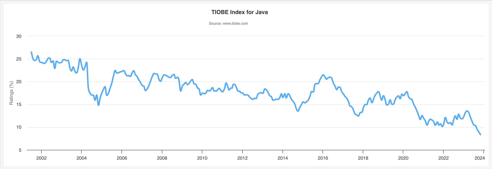

## Java 简介

引用 **_Oracle_** 官网的介绍：

> Oracle Java is the #1 programming language and development platform. It reduces costs, shortens development timeframes, drives innovation, and improves application services. With millions of developers running more than 60 billion Java Virtual Machines worldwide, Java continues to be the development platform of choice for enterprises and developers.

> Oracle Java 是排名第一的编程语言和开发平台。它可以降低成本、缩短开发时间、推动创新并改进应用程序服务。全球有数以百万计的开发人员运行着超过 600 亿个 Java 虚拟机，Java 仍然是企业和开发人员的首选开发平台。

## 2023 年 11 月 TIOBE 指数

> 最高排名（自 2001 年以来）：2020 年 4 月排名第一

> 最低排名（自 2001 年以来）：2023 年 11 月排名第 4

