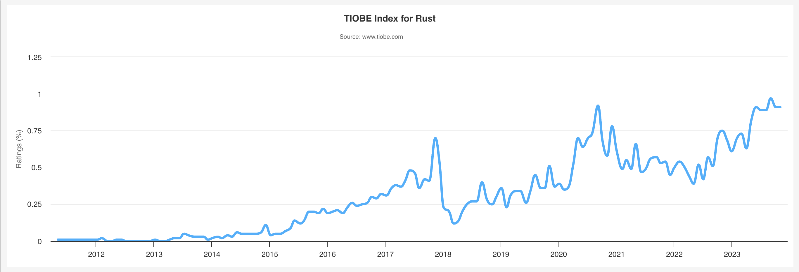

## Rust

引用官网的介绍：

> A language empowering everyone
> to build reliable and efficient software.

> 一门赋予每个人
> 构建可靠且高效软件能力的语言。

<!--
> 一门赋予每个人
> 构建可靠且高效软件能力的语言。
-->

## 为什么选择 Rust?

| 高性能                                                                                                                                      | 可靠性                                                                                          | 生产力                                                                                                                                                             |
| ------------------------------------------------------------------------------------------------------------------------------------------- | ----------------------------------------------------------------------------------------------- | ------------------------------------------------------------------------------------------------------------------------------------------------------------------ |
| Rust 速度惊人且内存利用率极高。由于没有运行时和垃圾回收，它能够胜任对性能要求特别高的服务，可以在嵌入式设备上运行，还能轻松和其他语言集成。 | Rust 丰富的类型系统和所有权模型保证了内存安全和线程安全，让您在编译期就能够消除各种各样的错误。 | Rust 拥有出色的文档、友好的编译器和清晰的错误提示信息， 还集成了一流的工具——包管理器和构建工具， 智能地自动补全和类型检验的多编辑器支持， 以及自动格式化代码等等。 |

## 2023 年 11 月 TIOBE 指数

> 最高排名（自 2011 年以来）：2023 年 9 月排名第 17

> 最低排名（自 2011 年以来）：2012 年 12 月排名第 211

